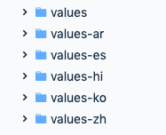
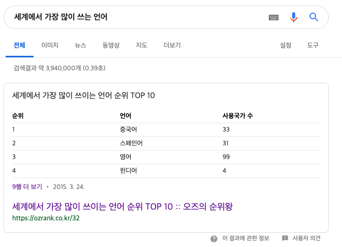
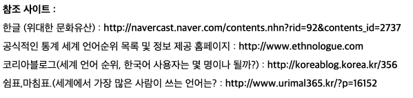

## 얼마나 현지화 해야 할까?

회사 프로젝트라면 개발자가 현지화(strings.xml  번역)을 신경쓰지 않아도 된다. 개발자가 의사결정하지 하지 않을 테니. 그러나 규모가 작은 개인 프로젝트라면 신경써야 한다. 필자의 경우 기본(영어) 외에 5개의 언어를 추가로 현지화한다.

### 현지화 언어 기준

아무 언어나 현지화 하지는 않는다. 현지화 할 언어의 기준이 필요하다. 필자의 경우 구글검색결과를 참고했다. 구글엔진에 의해 첫번째로 검색되는 '세계에서 가장 많이 쓰는 언어'의 내용이 담긴 웹사이트는 2015년 작성되었다. 좀 오래되긴 했으나 이 사이트가 참조하고 있는 다른 사이트가 신뢰할만 했기 때문에 구글의 검색결과를 기준을 현지화 작업 기준으로 삼았다.

## 리소스 폴더(value-xx) 포멧

values-xx에서 xx(ko, en, zh…)는 언어를 의미한다. [Android의 언어 포멧은 ISO 639 alpha-2](https://developer.android.com/reference/java/util/Locale)다. [alpha-2는 ISO 639-1과 같은 의미](https://ko.wikipedia.org/wiki/ISO_639)다. 때문에 안드로이드 언어 포멧은 ISO 639-1(ISO 639 alpha-2)로 하면 된다.

# 번역

구글 번역기..

# 결론

현지화는 정말 귀찮은 작업이다. 현지화를 통해 얻어지는 것은 무엇일까? 바로 광고 수입이다ㅋ 그러니 반드시 진행하자!